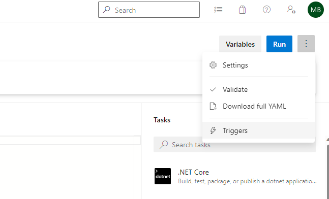
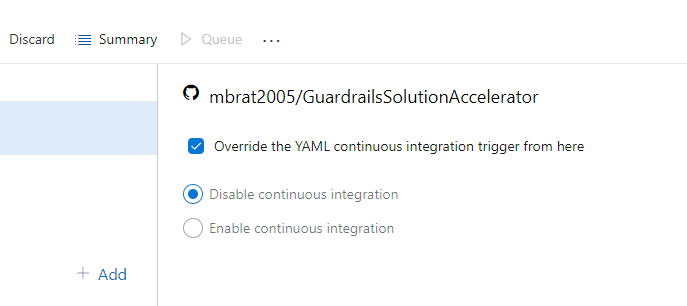

# Release Process

## Prerequisites

#### Create a Azure DevOps Pipeline that runs manually against your fork

1. Navigate to: https://dev.azure.com/guardrailssolutionaccelerator/GuardrailsSolutionAccelerator
2. Under Project Settings, create a Service Connection to your GitHub account, selecting the GuardrailsSolutionAccelerator fork
3. Create a new pipeline:

    1. Where is your code: **GitHub**
    1. Select a repository: Scroll past the list of repos and use the **'Select a specific Connection'** link at the very bottom of the page
    1. Select your GitHub Service Connection
    1. Select your **fork** of GuardrailsSolutionAccelerator
    1. Select the **'main'** branch and **'/ado-signing-pipeline.yml'** pipeline definition file
    1. Click the blue arrow on the Run button and choose Save
    1. Navigate to your new pipeline, choose Edit
    1. Find the Triggers settings under the '…' button:

       
    1. Choose to Override the YAML CI trigger then disable both CI and PR validation

       
    1. Save the Pipeline (do not run)

## Process to publish a new release

1. Merge any outstanding PRs intended to be included in the release 
2. Ensure your 'main' branch on your fork is in sync with 'Azure/GuardrailsSolutionAccelerator'

   ```git
    git checkout main
    git fetch upstream
    git reset --hard upstream/main
    git push --force
   ```

1. Create a new branch off of your fork's 'main' branch:
   `git checkout -b v1.0.x`
1. Update tags.json in your new branch to the new version, commit the change
1. Update sub-module versions by running ./tools/Update-ModuleVersions.ps1 [Module version updates are made locally for each PR]
1. Update the GuardrailsSolutionAccelerator.psd1 module version to match the release version (ex: release v1.0.6 should be '1.0.6' in the module manifest)
1. Commit your changes and publish your branch
1. Push your commit to GitHub
1. Navigate to Azure DevOps, find your Pipeline, and choose New Run. Select your new 'v1.0.x' branch.
1. Confirm that the DevOps pipeline executes all steps successfully
1. Navigate to the release artifact created by the DevOps pipeline execution, download it, and extract it on your local system
1. Copy and paste all files from the extracted Zip download to the directory containing your local clone of the repo (with the v1.0.x branch still checked out)
1. Spot-check that your local copy changes only include changes to PowerShell file signatures, Zip files, tags.json and that the most recent changes from 'Azure/GuardrailsSolutionAccelerator' are included in the local repo
1. Create a new PR from your fork to Azure/GuardrailsSolutionAccelerator 
1. Merge the PR
1. In GitHub Azure/GuardrailsSolutionAccelerator, create a new Release. On the tag selection, enter the new tag name that matches the release (ex: v1.0.6). 
1. Check the box to generate release notes based on the previous release tag (ex: v1.0.5)
1. Publish the release 
