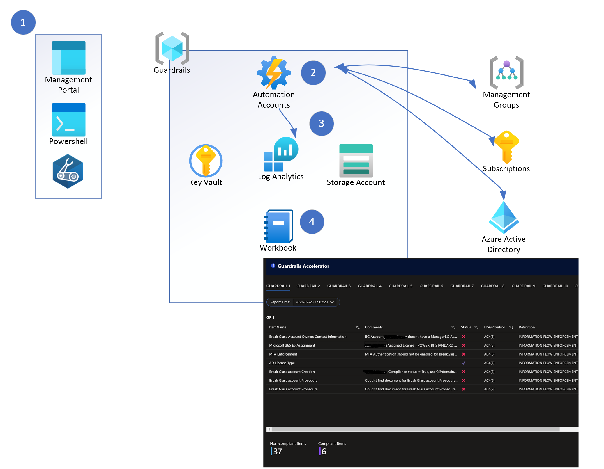

# Guardrails - Setup

## Configuration

Navigate to shell.azure.com and authenticate as a user that has Azure and Azure AD Permissions (To assign permissions to the Automation Account Managed Identity)

Clone repository

`git clone https://github.com/Azure/GuardrailsSolutionAccelerator.git`

cd to `.\Guardrailssolutionaccelerator`

Edit config.json with `code .\config.json' and adjust parameters as required.
All named resources will have the first 6 characters of the tenant Id appended to their names.

|Parameter|Description|
|---------|-----------|
|keyVaultName|Name for the KeyVault resource|
|resourcegroup|Resource Group to deploy the solution|
|region|Location to deploy. Canadacentral is the default|
|storageaccountName||
|logAnalyticsworkspaceName||
|autoMationAccountName||
|FirstBreakGlassAccountUPN||
|SecondBreakGlassAccountUPN||
|PBMMPolicyID|Guid of the PBMM applied policy. 4c4a5f27-de81-430b-b4e5-9cbd50595a87 is the default Id but a customized version may have been used.|
|AllowedLocationPolicyId|Guid for the Allowed Location policy. e56962a6-4747-49cd-b67b-bf8b01975c4c is the default|
|DepartmentNumber||
|CBSSubscriptionName|Subscription Id containing the CBS solution|
|SecurityLAWResourceId|Full resource Id of the Log analytics workspace used for Security|
|HealthLAWResourceId|Full resource Id of the Log analytics workspace used for resource Health|

Save the file and exit VSCode.

Note about policy definitions:

In the standard configuration file, the following parameters are pre-configured:

  `"PBMMPolicyID":"4c4a5f27-de81-430b-b4e5-9cbd50595a87",`

  `"AllowedLocationPolicyId": "e56962a6-4747-49cd-b67b-bf8b01975c4c",`

These are the default GUIDs for the "Canada Federal PBMM" Initiative and for the "Allowed Location" policy, respectively. If any other custom Initiative or Policy are used, please update the file as required. To list Initiative definitions and policies, use, respectively:

`Get-AzPolicySetDefinition | Select-Object Name -ExpandProperty Properties | select Name,DisplayName | Out-GridView`

`Get-AzPolicyDefinition | Select-Object Name -ExpandProperty Properties | select Name,DisplayName | Out-GridView`

## Deployment

If the deployment is being done using the Azure Cloud Shell, the currentuserUPN parameter below refers to the user logged in. This is required when using the cloud shell.

In a B2B scenario, please use the full user name, typically something like `user_inviteddomain#EXT@invitingDomain.com`

The solution will deploy new resources.

Run `.\setup.ps1 -configFilePath .\config-sample.json -userId <currentuserUPN>`

Alternatively, these parameters can be used to leverage existing KeyVault and Log Analytics resources:

`$existingKeyVaultName` : the name of an existing Keyvault. If provided, the RG below must be specified and the content of config.json will be ignored.

`$existingKeyVaultRG` : the resource group containing the Keyvault above.

`$existingWorkspaceName`: the name of an existing Log Analytics Workspace. If provided, the RG below must be specified and the content of config.json will be ignored. Also, for now, the Workbook will not be deployed automatically and will have to be added manually to the existing workspace.

`$existingWorkSpaceRG`: the resource group containing the Log Analytics Workspace above.

`$skipDeployment`: the setup script will run everything but the Azure Resources deployment (for debug/testing only)

## How it works

1 - The solution is deployment from the Azure Portal's cloud shell. After cloning the repository, some configuration may be done to the provided `config.json` file. Once triggered, the setup will deploy all the required components.

2 - Azure Automation will trigger the main runbook every hour. It will fetch information from multiple sources (AAD, Azure Resources, Storage Account).

3 - The data is then stored into the Log Analytics workspace.

4 - The data summary and details can be visualized using the provided Guardrails workbook.

