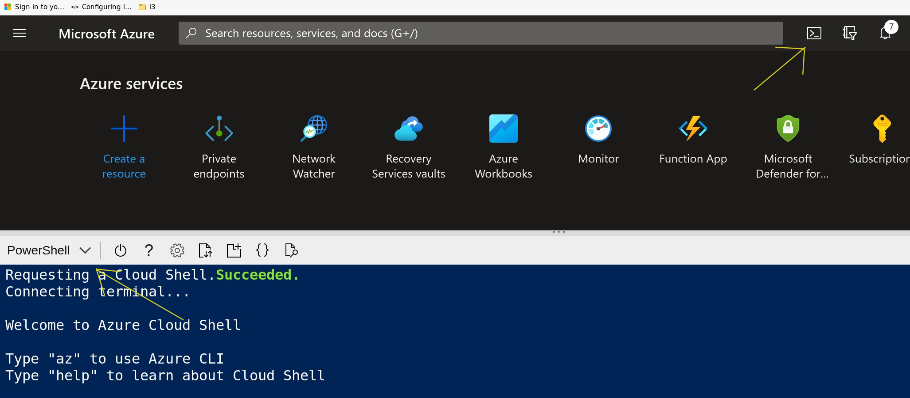

# Guardrails - Setup

## Requirements

- Azure Subscription
- Global admin permissions
- Configure user (the one used to setup ) to have "Access Management for Azure Resource" permissions. (https://docs.microsoft.com/en-us/azure/role-based-access-control/elevate-access-global-admin). The permission can be removed after the setup.

## Downloading

Navigate to Cloud Shell (from the Azure Portal) and authenticate as a user that has Azure and Azure AD Permissions (To assign permissions to the Automation Account Managed Identity).

Please make sure to select **PowerShell** as shell type.

<p align="center">

</p>

### Use Released Code (Recommended)

- Navigate to the repository main page and look for the Releases. Select the desired release and download the appropriate asset:
For example:
```
wget https://github.com/Azure/GuardrailsSolutionAccelerator/archive/refs/tags/relasenumber.zip
```
Then unzip the files and change directories (Example. Folder names will vary depending the release):
```
Expand-Archive ./v1.0.1.zip
```
```
cd ./v1.0.1/GuardrailsSolutionAccelerator-1.0.1/setup/
```
### Use current repo code

You may use the current repo code. Be aware that the code in the repo may be in the process of being updated. Some modules may not be signed. If there is a requirement for fully signed and release code, use the previous option.

```
git clone https://github.com/Azure/GuardrailsSolutionAccelerator.git
```
```
cd ./GuardrailsSolutionAccelerator/setup/
```

## Configuration

Edit config.json with:
```
code .\config.json
```
Adjust parameters as required.

All named resources will have the first 6 characters of the tenant Id appended to their names.

|Parameter|Description|
|---------|-----------|
|keyVaultName|Name for the KeyVault resource|
|resourcegroup|Resource Group to deploy the solution|
|region|Location to deploy. Canadacentral is the default|
|storageaccountName|name of the storage account to be used. 4 random characters will be added to this name to avoid conflicts|
|logAnalyticsworkspaceName| base name for the log analytics workspace|
|autoMationAccountName| base name for the automation account |
|FirstBreakGlassAccountUPN| UPN for the first break glass account|
|SecondBreakGlassAccountUPN| UPN for the second break glass account|
|PBMMPolicyID|Guid of the PBMM applied policy. 4c4a5f27-de81-430b-b4e5-9cbd50595a87 is the default Id but a customized version may have been used.|
|AllowedLocationPolicyId|Guid for the Allowed Location policy. e56962a6-4747-49cd-b67b-bf8b01975c4c is the default|
|DepartmentNumber| a number to be used by module 4 when looking for the existence of the monitoring account in Azure AD|
|CBSSubscriptionName|Subscription Name containing the CBS solution. This subscription will be used to find the required components. **This subscription will also be excluded from checks.**|
|SecurityLAWResourceId|Full resource Id of the Log analytics workspace used for Security (/subscriptions/...)|
|HealthLAWResourceId|Full resource Id of the Log analytics workspace used for resource Health (/subscriptions/...)|
|Locale|Language of the messages in the solution. At the moment, supported languages are english or french and default is english (en-CA or fr-CA)|
|lighthouseServiceProviderTenantID| If using Lighthouse cross-tenant delegated access to Guardrails data, specify the Azure AD tenant ID (GUID) of the managing tenant|
|lighthousePrincipalDisplayName| If using Lighthouse cross-tenant delegated access to Guardrails data, specify the display name of the Azure AD principal (group or user) to be delegated access to your Guardrails resource group|
|lighthousePrincipalId|If using Lighthouse cross-tenant delegated access to Guardrails data, specify the object ID (GUID) of the Azure AD principal (group or user) to be delegated access to your Guardrails resource group|
|lighthouseTargetManagementGroupID|If using Lighthouse cross-tenant delegated access to Guardrails data, specify the name of the Management Group under which all subscriptions will grant Defender for Cloud access to the managing tenant|

Save the file and exit VSCode.

Note about policy definitions:

In the standard configuration file, the following parameters are pre-configured:
```
"PBMMPolicyID":"4c4a5f27-de81-430b-b4e5-9cbd50595a87",

"AllowedLocationPolicyId": "e56962a6-4747-49cd-b67b-bf8b01975c4c",
```
These are the default GUIDs for the "Canada Federal PBMM" Initiative and for the "Allowed Location" policy, respectively. If any other custom Initiative or Policy are used, please update the file as required. To list Initiative definitions and policies, use, respectively:
```
Get-AzPolicySetDefinition | Select-Object Name -ExpandProperty Properties | select Name,DisplayName | Out-GridView`

Get-AzPolicyDefinition | Select-Object Name -ExpandProperty Properties | select Name,DisplayName | Out-GridView`
```

## Adding Tags to the Resource Group

In many organizations, Tags may be required in order for Resource Groups to be created. The Guardrails setup uses a file called `tags.json` to create tags for the Resource Group (only).

The only default tag is:
    
    {

        "Name":"Solution",

        "Value": "Guardrails Accelerator"

    }

Add tags as required per your policies in a json array format.

## Deployment

If the deployment is being done using the Azure Cloud Shell, the currentuserUPN parameter below refers to the user logged in. This is required when using the cloud shell.

In a B2B scenario, please use the full user name, typically something as below:

user_inviteddomain#EXT@invitingDomain.com

The solution will deploy new resources.

Run:
```
.\setup.ps1 -configFilePath .\config.json -userId <currentuserUPN>
```
Alternatively, these parameters can be used to leverage existing KeyVault and Log Analytics resources:

`$existingKeyVaultName` : the name of an existing Keyvault. If provided, **the RG below must be specified and the content of config.json will be ignored.**

`$existingKeyVaultRG` : the resource group containing the Keyvault above.

`$existingWorkspaceName`: the name of an existing Log Analytics Workspace. If provided, the RG below must be specified and the content of config.json will be ignored. Also, for now, the Workbook will not be deployed automatically and will have to be added manually to the existing workspace.

`$existingWorkSpaceRG`: the resource group containing the Log Analytics Workspace above.

`$skipDeployment`: the setup script will run everything but the Azure Resources deployment (for debug/testing only).

`$subscriptionId`: if specified, the setup script will try to deploy the solution in that subscription. If not specified, it will detect if multiple subscriptions are available and interactively ask which one to use.

### Lighthouse Configuration

If this Guardrails Accelerator solution will be deployed in a scenario where a central Azure tenant will report on the Guardrails data of this Azure tenant, include the `-configureLighthouseAccessDelegation` switch parameter when calling setup.ps1. 

In order for Azure Policy to automatically delegate access to Defender for Cloud data for every subscription under the specified Management Group, the Policy Assignment Managed Service Identity is granted 'Owner' rights at the Management Group scope. 

In addition, every subscription under the target management group (lighthouseTargetManagementGroupID) must be registered for the 'Microsoft.ManagedServices' Resource Provider. To accomplish this, the setup process creates a custom RBAC role called 'Custom-RegisterLighthouseResourceProvider', which includes only the permissions to register the Lighthouse resource provider. A role assignment is added for this role at the target Management Group for the Automation Account's managed identity, enabling a runbook to automatically register any existing or new subscriptions for the resource provider. 

For this feature to deploy, the following values must also existing the config.json file:

- lighthouseServiceProviderTenantID
- lighthousePrincipalDisplayName
- lighthousePrincipalId
- lighthouseTargetManagementGroupID

#### Troubleshooting Lighthouse Configuration

The Defender for Cloud automated Lighthouse delegation deployment to each subscription may take up to 24 hours to apply. If, after 24 hours, all subscriptions are not showing as properly delegated, ensure that the the Microsoft.ManagedServices and Microsoft.PolicyInsights Resource Providers are registered in each target subscription. Check that a Remediation Task exists at the target management group (on the customer side), and review it for deployment failures.